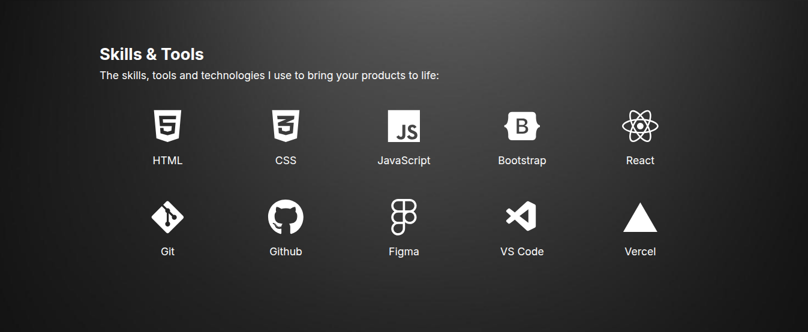

## Test Cases for Skills section on https://tracynjoroge.vercel.app/

## Summary

| Test ID | Title | Type | Status |
|---------|-------|------|--------|
| TCS001 | Verify static elements| Positive |  |

---

**Test ID:** TCS001

**Test Title:** Verify Skills section static elements display correctly

**Description:** Verify Skills section heading, description sentence and skill icons with names display correctly on page load

**Preconditions:**
- Website https://tracynjoroge.vercel.app/ is open in a desktop browser
- Internet connection is available
- User is currently viewing the Skills section

**Steps:**
1. Check the Skills heading is visible
2. Check the description sentence is visible
3. Check the skill icons with names are fully visible and correctly displayed

**Expected Result:** 
- Skills heading is fully visible and readable against the dark background
- Skills description sentence is fully visible and readable against the dark background
- All 10 skill icons are fully visible and correctly labelled with their names, and not cut off

**Post Condition:** User is now viewing the Skills section

**Test Type:** Positive

**Status:**

---

