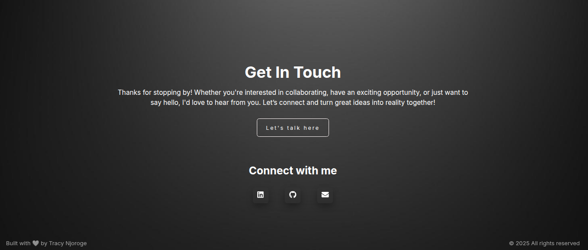

## Test Cases for Contact section on https://tracynjoroge.vercel.app/

## Summary

| Test ID | Title | Type | Status |
|---------|-------|------|--------|
| TCC001 | Verify static elements| Positive |  |

---

**Test ID:** TCC001

**Test Title:** Verify Contact section static elements display correctly

**Description:** Verify Contact section heading, paragraph, Connect with me heading, footer display correctly on page load

**Preconditions:**
- Website https://tracynjoroge.vercel.app/ is open in a desktop browser
- Internet connection is available
- User is currently viewing the Contact section

**Steps:**
1. Check the Contact heading is visible 
2. Check the Contact section paragraph is visible
3. Check the Connect with me heading is visible
4. Check the footer is visible and readable

**Expected Result:** 
- Contact heading is fully visible and readable against the dark background
- Contact section paragraph is fully visible and readable against the dark background
- Connect with me heading is visible and correctly positioned
- Footer text 'Built with ❤️ by Tracy Njoroge' and copyright notice are fully visible and readable against the dark background

**Post Condition:** User is now viewing the Contact section

**Test Type:** Positive

**Status:**

---