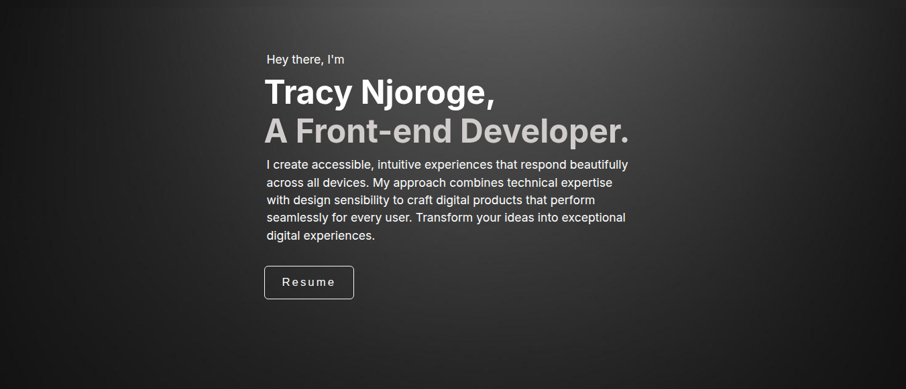

## Test Cases for Home section on https://tracynjoroge.vercel.app/

## Summary

| Test ID | Title | Type | Status |
|---------|-------|------|--------|
| TCH001 | Verify Static Elements| Positive |  |

---

**Test ID:** TCH001

**Test Title:** Verify Hero section static elements display correctly

**Description:** Verify Hero section static elements display correctly on page load

**Preconditions:**
- Website https://tracynjoroge.vercel.app/ is open in a desktop browser
- Internet connection is available
- User is currently viewing the Hero section

**Steps:**
1. Check the subheading "Hey there, I'm" is visible
2. Check the heading "Tracy Njoroge" is visible
3. Check the description paragraph is fully visible

**Expected Result:** 
- Subheading "Hey there, I'm" is fully visible and readable against the dark background
- Heading "Tracy Njoroge" is fully visible and readable against the dark background
- Description paragraph is fully visible, readable and not cut off

**Post Condition:** User is now viewing the Hero section

**Test Type:** Positive

**Status:**

---

**Test ID:** TCH002

**Test Title:** Verify Hero section animated text start on page load

**Description:** 

**Preconditions:**
- Website https://tracynjoroge.vercel.app/ is open in a desktop browser
- Internet connection is available
- User is currently viewing the Hero section

**Steps:**

**Expected Result:** 

**Post Condition:** User is now viewing the Hero section

**Test Type:** Positive

**Status:**

---
