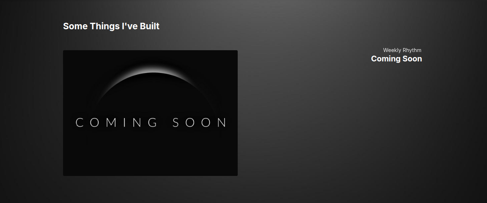
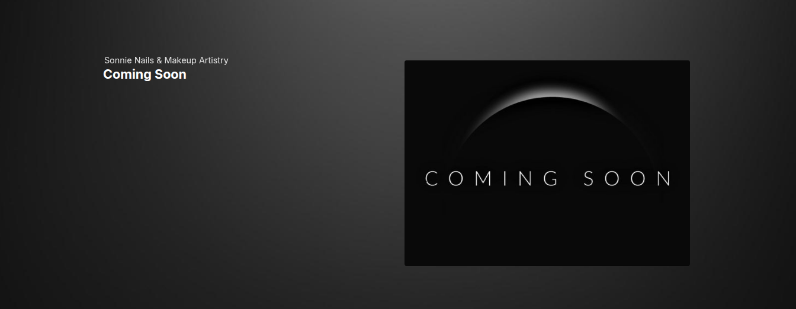
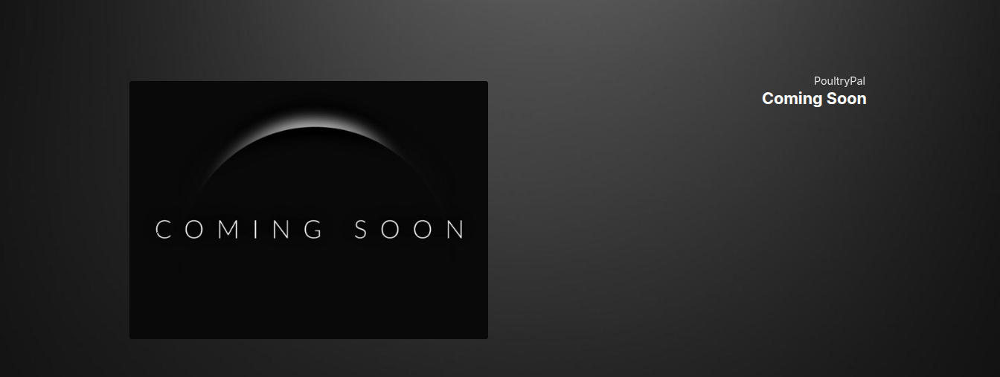

## Test Cases for Projects section on https://tracynjoroge.vercel.app/

## Summary

| Test ID | Title | Type | Status |
|---------|-------|------|--------|
| TCP001 | Verify static elements| Positive |  |
| TCP002 | | Positive |  |

---

**Test ID:** TCP001

**Test Title:** Verify Projects section static elements display correctly

**Description:** Verify Projects section heading, "Coming Soon" image, and "Coming Soon" status text display correctly on page load

**Preconditions:**
- Website https://tracynjoroge.vercel.app/ is open in a desktop browser
- Internet connection is available
- User is currently viewing the Projects section

**Steps:**
1. Check the Projects heading is visible and readable in the dark background
2. Check all 3 'Coming Soon' images are visible and displayed correctly
3. Check all 3 "Coming Soon" status texts are visible and readable in the dark background

**Expected Result:** 
- Projects heading "Some Things I've Built" is fully visible and readable against the dark background
- All 3 'Coming Soon' images are fully visible and not broken
- All 3 'Coming Soon' status texts are fully visible and readable against the dark background

**Post Condition:** User is now viewing the Projects section

**Test Type:** Positive

**Status:**

---

**Test ID:** TCP002

**Test Title:** Verify Projects name changes background color on hover

**Description:** Verify Projects name changes from static to a brighter color change on hover

**Preconditions:**
- Website https://tracynjoroge.vercel.app/ is open in a desktop browser
- Internet connection is available
- User is currently viewing the Projects section

**Steps:**
1. Hover on 'Weekly Rhythm' project name
2. Observe what happens
3. Move mouse away from project name
4. Observe what happens
5. Hover on 'Sonnie Nails & Makeup Artistry' project name
6. Observe what happens
7. Move mouse away from project name
8. Observe what happens
9. Hover on 'PoultryPal' project name
10. Observe what happens
11. Move mouse away from project name
12. Observe what happens

**Expected Result:** 
- 'Weekly Rhythm' has a lighter background color on hover and returns to static state when you move the mouse away
- 'Sonnie Nails & Makeup Artistry' has a lighter background color on hover and returns to static state when you move the mouse away
- 'PoultryPal' has a lighter background color on hover and returns to static state when you move the mouse away

**Post Condition:** User is now viewing the Projects section

**Test Type:** Positive

**Status:**

---

